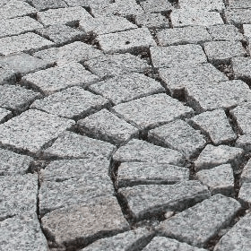
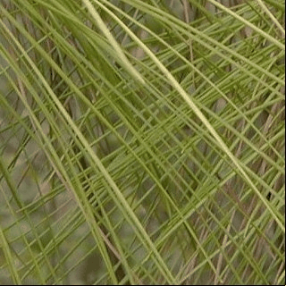
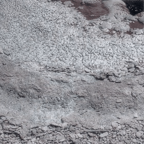

#  **Transmute2K**: Library of Image Transformations Simulations and Augmentations,  based  2K methods, models and simulation from science, art and math.

**Transmute2K** is a large-scale library and dataset containing 2,000 image transformation methods based on techniques, simulations and models from various fields of science, math and art that have been adapted for image manipulation and image-processing.

In general, the transformations can be applied to standard **RGB images**, as well as to images or maps of other types, such as **PBR materials** and hyperspectral maps.

Each transformation follows a model or function. This can range from simple operations such as rotation and blurring to more complex physical and scientific models involving diffusion, clustering, topology,camera effect, optica, physical and chemical proccess and other forms of simulation, with the image used as the working medium on which the transformation operates on.

The transformations are divided into two groups:

1. **Image-to-image transformations**, which transform one image into another according to a specific model, such as cross-fading.
2. **Single-image transformations**, which modify one image using a specific process, such as blurring or diffusion.

Each transformation function receives either one image or a pair of images and outputs a sequence of images corresponding to different stages of the transformation.

The input can be a standard RGB image or another type of map, such as a PBR material map or a spectral map.

The transformations were collected from a wide range of fields. Some use standard image-augmentation or image-modification functions, while others adapt models and simulations from different scientific and artistic domains and apply them to images.

The dataset was created/collected using an agentic AI pipeline based on several large language models, (GLM, KIMI) with human manual inspection and filtering of the results. 

# Download Dataset From: [HuggingFace](https://huggingface.co/datasets/FlyingFrog/Transmute2K-Library-of-Image-Transformations-Simulations-and-Augmentations/tree/main)   or [Zenodo](https://zenodo.org/records/21420242)

## Examples of Image-to-Image Transformations

<table cellpadding="0" cellspacing="0" border="0">
  <tr>
    <td width="25%"></td>
    <td width="25%"></td>
    <td width="25%"></td>
    <td width="25%"></td>
  </tr>
  <tr>
    <td width="25%"></td>
    <td width="25%"></td>
    <td width="25%"></td>
    <td width="25%"></td>
  </tr>
</table>

## Examples of Single-Image Transformations

<table cellpadding="0" cellspacing="0" border="0">
  <tr>
    <td width="20%"></td>
    <td width="20%"></td>
    <td width="20%"></td>
    <td width="20%"></td>
    <td width="20%"></td>
  </tr>
</table>

# File Structure

## Code Files

Python scripts for all approximately 2,000 transformations are available in:

```text
Code_image2image_transformations.zip
Code_single_image_transformations.zip
``` 

The dataset-generation pipeline is available in:

```text
dataset_generation_code.zip
```


## Image Transformation Sequences

Sequences of images generated by each transformation are available in files whose names begin with **transformation_sequence**

Each file contains an sequence of images of every transformation in the dataset applied to a random image or pair of images.

## Image Transformation As Animated GIFs

Files whose names begin with **GIF** contain examples of each transformation as animated GIFs.

## PBR Material Transformation Sequences

Files whose names begin with **PBR** contain examples of the transformations applied to PBR materials (As sequence of PBRs)


# Code Structure

Each transformation code folder contains:

```text
description.txt
generate.py
```

The `description.txt` file contains a description of the transformation.

The `generate.py` script contains the transformation code and the transformation function.

## Image-to-Image Transformations

For image-to-image transformations, the transformation is implemented in the following function:

```python
transform(start_map, end_map, params=None, numsteps=None)
```

### Parameters

#### `start_map`

The starting image or map as a NumPy array.

#### `end_map`

The target image or map as a NumPy array.

#### `params`

An optional dictionary containing transformation-specific parameters.

#### `numsteps`

The optional number of steps in the generated transformation sequence.

`start_map` and `end_map` must have identical shapes.

The expected array layout is:

```text
[height, width, channels]
```

## Return Value

The function returns a list of maps with the same shape as `start_map`.

Each item in the list represents one stage of the gradual transformation from `start_map` to `end_map`.

# Example run
See: [run_img2img_transform.py](run_img2img_transform.py) __main__ for example on running the transformation on images and PBRs

## Single-Image Transformations

For single-image transformations, the transformation function is:

```python
transform(input_map, params=None, numsteps=None)
```

The parameters are the same as for image-to-image transformations, except that the function receives a single input map instead of two.


## Return Value

The function returns a list of maps with the same shape as input map.

Each image in the output list represents one stage of the transformation.

# Running transformation

See [run_single_im_transform.py](run_single_im_transform.py) `__main__` for examples of running transformations on images or PBRs.
